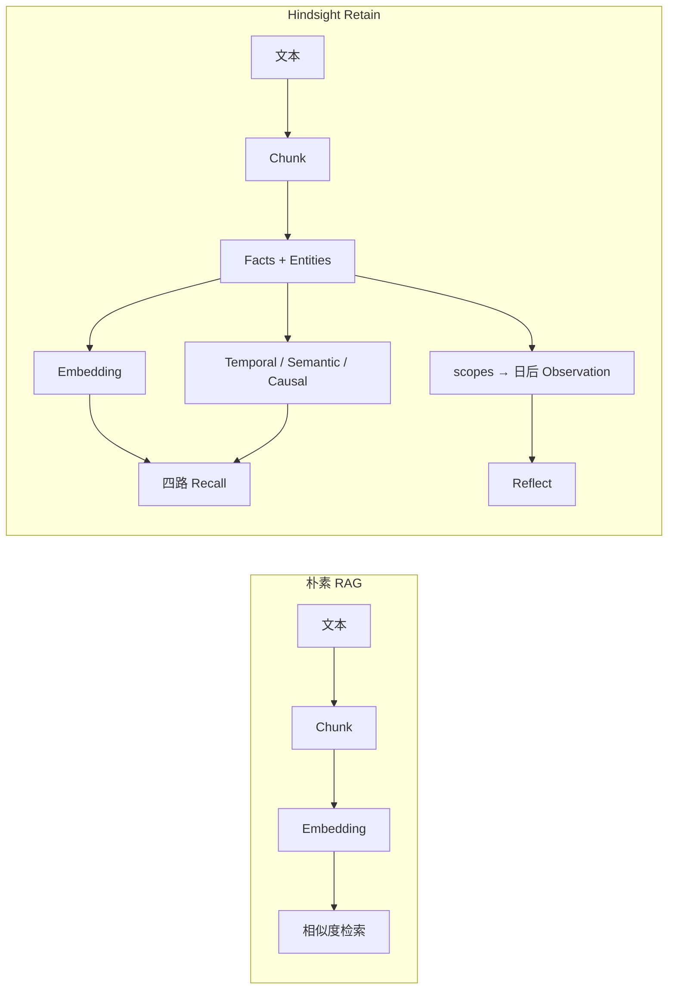
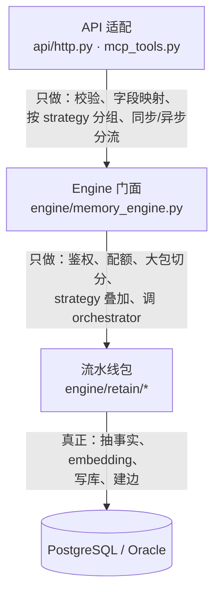
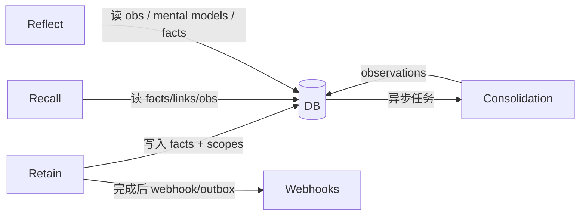

# 01 — 大图：Retain 要解决什么

## 1. 产品层面：为什么不是 RAG 式「切块入库」

传统做法：原文切块 → 向量 → 查询时相似检索。  
Hindsight 的 Retain 额外做了三件事：

1. **抽事实（facts）**：把自然语言压成可独立存在的断言（world / experience），而不是只存 chunk 原文。  
2. **建结构**：实体归一、时间边、语义边、因果边——给后续 **graph / temporal** 召回「有米下锅」。  
3. **为巩固留钩子**：`tags`、`observation_scopes` 先落在事实上，**Observation 合并**交给事后的 consolidation。

对照官方文档心智（可选）：`skills/hindsight-docs/references/developer/rag-vs-hindsight.md`。

**为什么这么做**：Agent 要的是「学到什么、和谁有关、何时发生、后来信念如何变」，不是「哪段原文像这句话」。事实层是统一语义基元；reflect / mental models 建在其上。

---

## 2. 代码层面：三层，不要混着读

| 层 | 该问的问题 | 不该在这一层找的东西 |
|----|------------|----------------------|
| API | 请求长什么样？async 怎么回？ | LLM prompt、SQL |
| MemoryEngine | 何时入队？如何切大 batch？config 怎么 resolve？ | 单个 chunk 怎么抽 |
| `retain/` | 事实怎么来、怎么进事务、delta 怎么判 | HTTP 状态码细节 |

**巨石文件提醒**：`memory_engine.py`（约 1.4 万行）、`api/http.py`（约 7 千行）**禁止整文件阅读**，只按函数名跳转。

---

## 3. 记忆长什么样（读库锚点）

一次成功的 Retain，大致留下：

| 产物 | 含义 | 主要写入位置 |
|------|------|----------------|
| `documents` | 逻辑文档（含 `content_hash`、可选 `original_text`） | `retain/fact_storage.py` · `handle_document_tracking` 等 |
| `chunks` | 切块 + `content_hash`（delta / 崩溃恢复用） | `retain/chunk_storage.py` |
| `memory_units` | **事实**（记忆单元） | `retain/fact_storage.py` · `insert_facts_batch` |
| `unit_entities` 等 | 事实↔实体 | Phase2 里 `entity_resolver` |
| `memory_links` | 时序 / 语义 / 因果 | `retain/link_creation.py` → `link_utils.py` |
| observations | **不在 retain 请求内完成** | `engine/consolidation/` |

**设计选择**：UI 上「实体—实体」的展示边，很多是 `/graph` 从 `unit_entities` **按需派生**的，而不是 retain 时写满（见 `orchestrator._insert_facts_and_links` 文档字符串）。原因：检索关键边必须原子写入；可视化边失败不该拖垮记忆本体。

---

## 4. 和旁边系统的边界

- **Retain**：负责「进来并结构化」。  
- **Consolidation**：负责「跨多条事实形成/更新 observation」。  
- **Recall / Reflect**：消费侧，不在本目录展开。

下一篇用一次具体请求，把三层串起来：[02-end-to-end.md](./02-end-to-end.md)。
