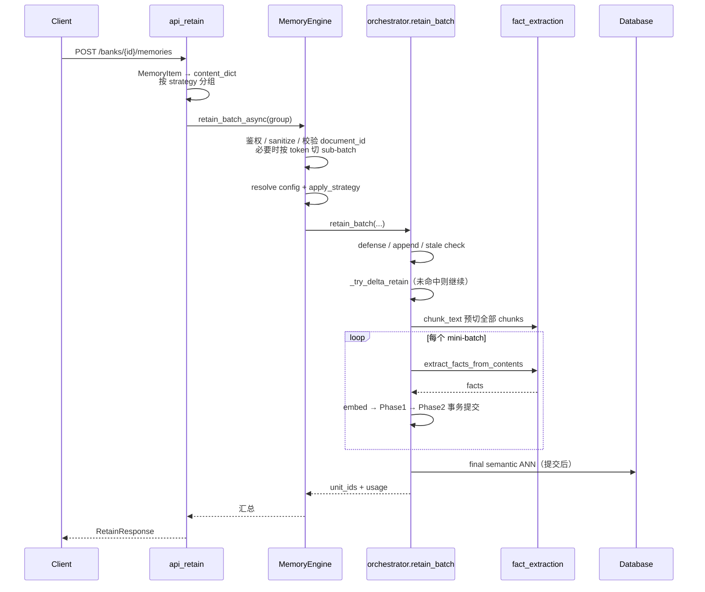
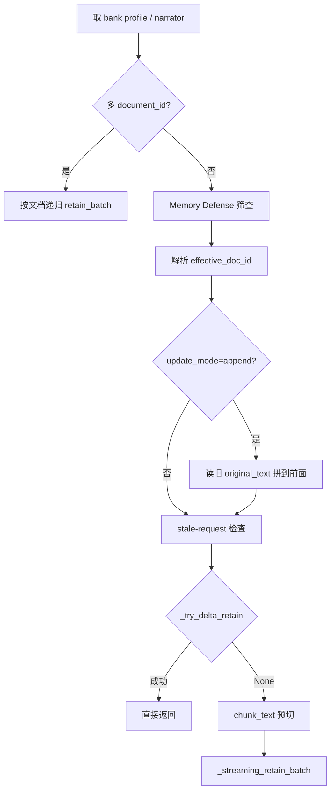
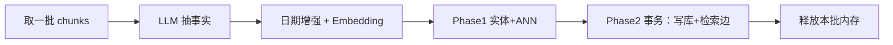

# 02 — 端到端：一次 Retain 请求怎么走

以最常见路径为例：**文本 JSON、同步、`async=false`、未命中 delta**。  
异步 / 文件 / delta 见 [03-design-decisions.md](./03-design-decisions.md)。

---

## 总览时序

---

## Step 1 — HTTP：只做「翻译 + 分流」

**定位**：`api/http.py` → `api_retain`（搜函数名）  
请求体模型：同文件 `RetainRequest` / `MemoryItem`。

**在做什么**：

1. 把每条 `MemoryItem` 收成引擎用的 `content_dict`（`timestamp` → `event_date`，`unset` → `None` 等）。  
2. **按 `item.strategy` 分组**——同一请求里可以有多种 strategy，但每种必须单独进引擎。  
3. `async=false` → `retain_batch_async`；`async=true` → `submit_async_retain`。

**为什么在 HTTP 层分组 strategy？**  
Engine 内部 `apply_strategy` 是「整批套一套 config」。若把 `conversations` 和 `documents` 混进一次 `retain_batch`，只能套其中一套，抽取规则/chunk 大小会错。  
带 `operation_id` 时还要求只能一组 strategy，否则幂等键语义不清 → 400。

**此步不做什么**：不调 LLM、不写业务表。

---

## Step 2 — MemoryEngine：门面与护栏

**定位**：`engine/memory_engine.py`

| 函数 | 职责 |
|------|------|
| `retain_batch_async` | 公开主入口 |
| `_retain_batch_async_internal` | 真正调 orchestrator 前的 config 准备 |
| `_split_contents_into_sub_batches` | 同步路径过大时切分 |

**在做什么（顺序）**：

1. 租户鉴权、可选 `OperationValidator`（额度、改写 contents）。  
2. **深拷贝** contents——后面 orchestrator 会 `pop("content")` 省内存，不能污染调用方。  
3. `sanitize_text`：干掉会打崩 embedder 的坏 Unicode（源码指向 issue **#1875**）。  
4. 校验：同批不能有重复 `document_id`；`append` 必须有 `document_id` 且开启文档正文存储。  
5. 按 token 预算切 sub-batch（过大时）；同文档多片时算 `chunk_index_offset`（防 **#1888**）。  
6. `_retain_batch_async_internal`：`resolve_full_config` →（可选）强制 chunks 模式 → `apply_strategy` → `orchestrator.retain_batch`。

**为什么 Engine 这么厚？**  
编排横切关注点（安全、计费、配置层级、异步入队）集中在一处，让 `retain/` 包专注「抽+写」。代价是 `memory_engine.py` 巨石——所以只能按函数跳。

---

## Step 3 — `retain_batch`：文档级编排骨架

**定位**：`engine/retain/orchestrator.py` → `retain_batch`

进入流水线后，先处理「文档级」问题，再进入 chunk 循环：

### 几个「为什么」

**Narrator（`_resolve_narrator`）**  
抽取 prompt 可注入「Narrator: 名字」，用来消解第一人称。但自动建 bank 时 `name == bank_id`，而 bank_id 常是路由键（`agent::channel::user`）。若注入，路由键会写进事实文本并污染 observation → **#1680**：此时直接不注入。

**Memory Defense**  
在抽事实前筛敏感内容：ALLOW / REDACT / BLOCK。全员 BLOCK 抛 `MemoryDefenseAllBlockedError` → HTTP 422。定位：`retain_batch` 前段 + `extensions/memory_defense.py`。

**Append**  
不是「只插新事实」，而是取出已存正文，拼成完整文档再走后续（常配合 delta 跳过未变 chunk）。定位：`retain_batch` 中 `update_mode == "append"` 段；读正文：`fact_storage.get_document_content`。

**Stale-request**  
若文档 `updated_at` 已新于本次请求开始时间，直接跳过，避免旧请求覆盖新会话。真正正确性仍靠事务里 `FOR UPDATE` + hash（注释写明这是优化）。

---

## Step 4 — 切块：为 LLM 和 idempotency 服务

**定位**：`engine/retain/fact_extraction.py` → `chunk_text`

**行为要点**：

- 普通文本：句子感知切分。  
- JSON 对话数组 / JSONL：尽量在轮次/行边界切，避免切断一条发言。  
- **幂等**：对输出再 `chunk_text` 一次，结果不变。

**为什么必须幂等？**  
流水线会「先整篇预切，抽取阶段再对每片切一次」。若第二次切开，子块会继承同一个 `chunk_index`，`chunk_id = {bank}_{doc}_{index}` 冲突 → **#2301**。

切完后 orchestrator 会清空 `RetainContent.content` 大字符串，只留 `all_pre_chunks` 工作集——**为了内存**（大文档可达数 MB×N）。

---

## Step 5 — Streaming mini-batch：主执行路径

**定位**：`orchestrator._streaming_retain_batch`

即使小文档也走这条路（通常只有 1 个 batch），避免维护两套代码（源码注释原话）。

每个 mini-batch 大致：

| 子步骤 | 函数 | 为什么 |
|--------|------|--------|
| 抽事实 | `_extract_and_embed` → `extract_facts_from_contents` | 把自然语言变成事实；失败要抛出，不能静默 0-fact 却标成功（**#1833**） |
| Embedding | `embedding_processing` → `embedding_utils` | 给语义检索与语义边用；注意两文件有同名 `generate_embeddings_batch` |
| Phase1 | `_pre_resolve_phase1` | 实体解析、ANN 预计算在**事务外**，避免长事务持锁 |
| Phase2 | `_insert_facts_and_links` | facts + unit_entities + temporal/semantic/causal **同事务**，保证 Recall 看不到半套数据 |
| 崩溃恢复 | 同文件前部 hash 检测 | 同 content_hash 且已有 chunk → 跳过已提交块（见 03） |

文档跟踪（删旧插新）被故意挪到**第一个写事务内**，并用 `SELECT … FOR UPDATE`，避免「先删文档、再抽 LLM」中间被并发插进来导致重复（见 `_streaming_retain_batch` 注释）。

---

## Step 6 — 收尾与返回

- **`_run_final_semantic_ann`**：提交后做全量语义邻居；失败不应回滚已写入的事实（链接是增强，不是记忆本体）。  
- 返回 `(每条 content 的 unit_id 列表, TokenUsage, processed_content_tokens)`。  
- HTTP 层汇总 `usage`，组 `RetainResponse`。

**Observation 还没建完**：`observation_scopes` 已写在 fact / retain_params 上，合并在 consolidation 任务里做。

---

## 同步路径上「你该打开的最少文件」

1. `api/http.py` · `api_retain`  
2. `engine/memory_engine.py` · `retain_batch_async` → `_retain_batch_async_internal`  
3. `engine/retain/orchestrator.py` · `retain_batch` → `_streaming_retain_batch`  
4. `engine/retain/fact_extraction.py` · `chunk_text`、`extract_facts_from_contents`  
5. `engine/retain/fact_storage.py` · `insert_facts_batch`（扫一眼字段即可）

下一篇专门讲那些「不走上面这条直线」的设计：[03-design-decisions.md](./03-design-decisions.md)。
