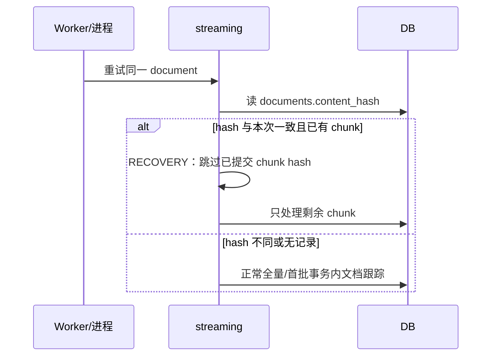
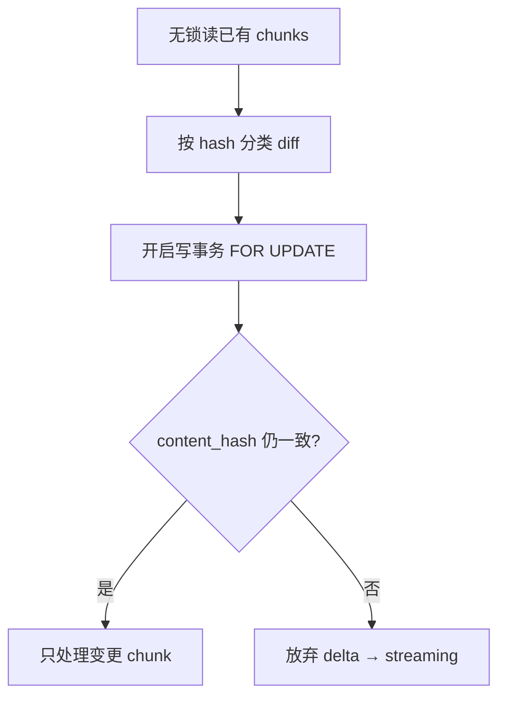
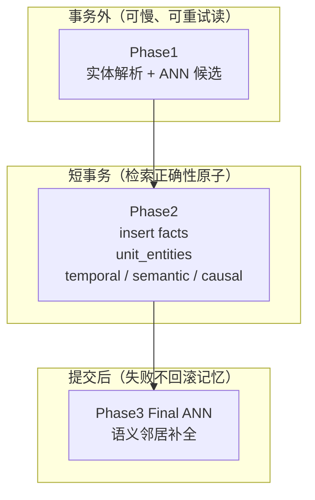
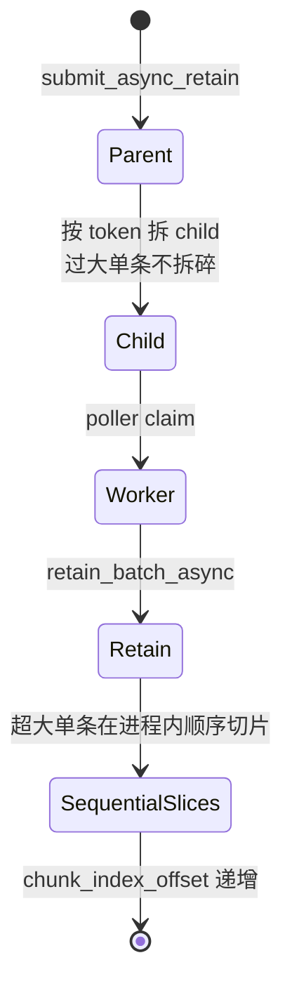

# 03 — 硬设计：为什么这样实现

本篇回答「明明可以更简单，为什么搞这么复杂」。  
证据来自源码注释与 Claude Code 交叉阅读；推断处标 ⚠️。

---

## 1. Streaming mini-batch —— 抗 OOM 与可恢复

**定位**：`orchestrator._streaming_retain_batch`

### 问题

大文档（注释提到 17k+ chunks）若一次 extract→embed→写库，内存与失败代价都不可接受：要么 OOM，要么失败整篇作废。

### 做法

1. 先 `chunk_text` 得到完整 chunk 列表。  
2. 按 `retain_chunk_batch_size` 切成 mini-batch。  
3. 每个 mini-batch：完整跑抽取 → Phase1/2 → **提交** → 释放本批结构。  
4. 小文档也走同一路径（只有一个 batch），避免双实现漂移。

### 崩溃恢复怎么做

要点：

- **文档级** `content_hash` + **块级** hash 双保险。  
- 文档跟踪放进写事务 + `FOR UPDATE`，避免旧版「先删后抽」的并发空洞。

### 和「一次做完」比

| | One-shot | Streaming |
|--|----------|-----------|
| 失败粒度 | 整篇 | 一个 mini-batch |
| 内存峰值 | 随全文事实集涨 | 有界 |
| 代码路径 | 简单 | 需 recovery / offset / outbox 边界情况 |

---

## 2. Delta retain —— 少花钱，但仍要正确

**定位**：`orchestrator._try_delta_retain`、`_classify_chunk_diff`、`_delta_metadata_only`

### 问题

同一 `document_id` upsert（例如聊天会话变长）若每次整篇重抽，LLM 费用和延迟爆炸。

### 做法

1. 加载旧 chunks（**无锁读**，避免长读占连接）。  
2. 新内容切块，按 `content_hash` 分成 unchanged / changed / new / removed。  
3. 只对变化部分走抽取；全未变则 `_delta_metadata_only`。  
4. 写事务里 **`FOR UPDATE` 再核 content_hash**：若已被并发请求改掉 → 返回 `None`，回退全量 streaming（streaming 全程有锁保护）。

**模式名**：乐观读 + 事务内校验。

**与 append 的关系**：append 先拼旧正文，再进入（常命中）delta，未变前缀 chunk 被跳过。

---

## 3. Phase1 / Phase2 / Phase3 —— 事务边界怎么画

**定位**：

- Phase1：`orchestrator._pre_resolve_phase1`  
- Phase2：`orchestrator._insert_facts_and_links`  
- Phase3：`orchestrator._run_final_semantic_ann`

| 放外面 | 放里面 | 放提交后 |
|--------|--------|----------|
| 扫库找同名实体、向量 ANN | facts + 检索必需的边 | 更多语义边；UI 向的增强 |

**窗口问题 #2662**：Phase1 解析到的实体，可能在进入 Phase2 前被 `prune_orphan_entities` 删掉。对策：Phase2 事务内 `reassert_entities_batch` 再钉住父实体，再写 `unit_entities`。

**占位 ID**：Phase1 时尚无真实 `unit_id`，用占位；插入后 `_remap_phase1_results` 重映射。

---

## 4. Async parent / child —— 幂等与超大文档

**定位**：`memory_engine.submit_async_retain`、`_handle_batch_retain`、`_split_contents_into_async_children`

### 为什么要 `operation_id` 幂等

客户端超时重试时，同一 UUID 应「返回原操作、不再入队」。  
注释强调：幂等 **读** 故意不和创建放同一事务；真正互斥靠 **主键唯一**，冲突时 unique-violation 兜底。

### 为什么超大单条不拆成并发兄弟 child（#1795）

Worker 之间**没有** per-document 串行。若多个 child 共享同一 `document_id` 且都以为自己是 `is_first_batch`：

- 会互相 cascade-delete 对方已写的 units  
- 最终 ANN 插 link 时撞 FK、连接池被打满  

所以：过大 item **整块一个 child**，在 worker **进程内顺序**切 sub-batch，并用 `chunk_index_offset` 续上 `chunk_index`（**#1888**）。  
`document_body_override` 保证 `documents.original_text` 存的是全文，不是最后一片（**#1838**）。

### Parent 行为什么常没有 task_payload

Parent 是状态聚合器；children 才有任务体。二者须同事务创建，否则孤儿 parent 永远不被执行，队列指标一直涨。

---

## 5. Strategy 与配置层级

**定位**：

- HTTP 分组：`api_retain`  
- 应用：`config_resolver.apply_strategy`（由 `_retain_batch_async_internal` 调用）  
- 配置字段：`config.py` 里 `retain_strategies` / `retain_default_strategy`

**思路**：同一 bank 要既能吃聊天，也能吃长文档 → 命名策略覆盖 `retain_extraction_mode`、`retain_chunk_size`、`retain_mission` 等。  
**强制规则**：一批 engine 调用 = 一套 resolved config；混合 strategy 必须在 HTTP 拆开。

LLM provider 为 `"none"` 时：强制 `retain_extraction_mode=chunks`，关闭 observations——没有模型就别假装抽事实。

---

## 6. 事实，而不是原文作为 memory unit

**定位**：抽取入口 `fact_extraction.extract_facts_from_contents`；写入 `fact_storage.insert_facts_batch`。

**产品命题**（⚠️ 结合 CLAUDE.md + 代码结构）：Agent 记忆是「断言网络」，以便：

- 去重与冲突在 observation 层处理  
- 图/时序检索挂在边上  
- Reflect 按 Mental Model → Observation → Fact 层级推理  

**实现细节佐证**：抽取 system prompt 刻意 **与 bank 无关**（mission 放 user message），便于跨 bank 共享模型缓存（见 `_build_extraction_prompt_and_schema` 注释）——说明「事实层」被当成统一语义基元。

`retain_extraction_mode=chunks` 是逃生舱：不调 LLM，整 chunk 当单元（只要向量检索）——速度/成本优先时用。

---

## 7. Observation scopes 为何不在 Retain 里 consolidate

**定位**：

- 写入钩子：`orchestrator._build_retain_params`、`fact_storage.insert_facts_batch`（字段 `observation_scopes`）  
- 消费：`engine/consolidation/consolidator.py` · `run_consolidation_job`、`_parse_observation_scopes` / `_resolve_write_scopes`

**原因**：

1. Streaming **按 chunk 提交**，retain 进行中往往没有「全文事实全集」，观察需要跨 chunk / 跨文档聚合。  
2. Consolidation 自身又是一轮（多轮）LLM，塞进 retain 会把写入延迟与综合强耦合。⚠️  
3. 职责分离后，事实变更可以作废并重跑 observation（`delete_stale_observations_for_memories` 等）。

scopes 语义（`per_tag` / `combined` / `shared` / 自定义）见官方：`skills/hindsight-docs/references/developer/api/retain.md`。

---

## 8. 抽取失败必须「响亮」

**定位**：`fact_extraction` 内多处；注释 **#1833**。

若抽取失败却返回空列表并提交：文档会以 0 facts 落库且操作显示 completed——**记忆静默丢失**。  
因此重试耗尽、协议异常等路径应 **raise**，让上层标失败/可重试，而不是假装成功。

---

## 9. 其它值得记住的不变量

| 不变量 | 位置 / issue |
|--------|----------------|
| `chunk_id = {bank}_{doc}_{chunk_index}` 确定性 | #1888 #2301 |
| 批内 document_id 唯一 | `retain_batch_async` / `submit_async_retain` |
| 引擎就地改 dict → 入口必须拷贝 | `retain_batch_async` |
| causal 跨 chunk 要平移 ordinal | streaming consumer（`fact_index_offset`） |
| Batch API 开启时禁止同步 retain | `api_retain` + `retain_batch_enabled` |
| embedding 维度不匹配视为不可重试 | PR #1670 相关注释 |

---

## 建议对照的测试

目录：`hindsight-api-slim/tests/`

- `test_delta_retain.py` / `test_retain_append_mode.py`  
- `test_async_batch_retain.py` / `test_async_retain_operation_id.py`  
- `test_retain_same_document_concurrency.py`  
- `test_retain_transient_extraction_failure.py`  
- `test_retain_pipeline_cancellation.py`

读测试名 + 断言，往往比读实现更快建立「预期行为」。

下一篇是精简代码地图：[04-code-map.md](./04-code-map.md)。
