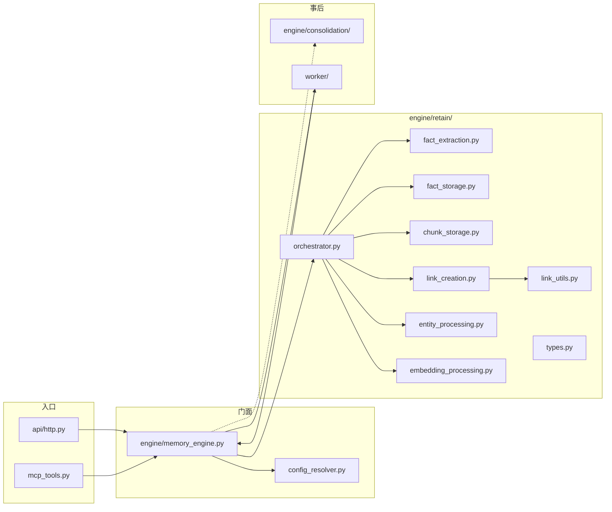

# 04 — 代码地图与跳读清单

配合 [02](./02-end-to-end.md) / [03](./03-design-decisions.md) 使用：这里只回答「去哪打开」。

路径前缀：`hindsight-api-slim/hindsight_api/`。

---

## 1. 按职责找文件

| 文件 | 一句话 | 何时打开 |
|------|--------|----------|
| `api/http.py` | HTTP 模型 + `api_retain` / `api_file_retain` | 看入参与分流 |
| `engine/memory_engine.py` | 门面、切批、异步、worker handler | **只跳函数名** |
| `engine/retain/orchestrator.py` | 总编排 | 主读 |
| `engine/retain/fact_extraction.py` | 切块 + LLM | 关心抽取质量时 |
| `engine/retain/types.py` | 管道数据结构 | 理清字段 |
| `engine/retain/fact_storage.py` | 文档与 facts 持久化 | 看落库 |
| `engine/retain/chunk_storage.py` | chunk hash / 存取 | delta / recovery |
| `engine/retain/link_creation.py` | Phase2 建边薄封装 | 短，可通读 |
| `engine/retain/link_utils.py` | 建边实现 | 深挖边算法时 |
| `engine/retain/embedding_processing.py` | 日期增强 + 调 embed | 短 |
| `engine/retain/embedding_utils.py` | embed 真实现 | 与上者同名函数勿混 |
| `engine/retain/entity_processing.py` | `resolve_entities` | 短 |
| `engine/retain/entity_labels.py` | 标签配置 → schema | 定制实体时 |
| `engine/retain/bank_utils.py` | bank profile / index | narrator、建 bank |
| `engine/consolidation/consolidator.py` | observation 合并 | retain **之后** |
| `config_resolver.py` | `apply_strategy` | strategy 行为 |
| `extensions/memory_defense.py` | 写入前防御 | 安全策略 |
| `worker/poller.py` | 领任务 / parent 聚合 | 异步运维 |

---

## 2. Top 跳转函数（建议收藏）

| # | 定位 | 读它为了什么 |
|---|------|----------------|
| 1 | `api/http.py` · `api_retain` | 请求如何变成 engine 调用 |
| 2 | `memory_engine.py` · `retain_batch_async` | 护栏与切批 |
| 3 | `memory_engine.py` · `_retain_batch_async_internal` | config + 进入 orchestrator |
| 4 | `memory_engine.py` · `submit_async_retain` | 异步入队与幂等 |
| 5 | `memory_engine.py` · `_handle_batch_retain` | worker 如何接回同步流水线 |
| 6 | `retain/orchestrator.py` · `retain_batch` | 文档级骨架 |
| 7 | `retain/orchestrator.py` · `_streaming_retain_batch` | 主执行循环 |
| 8 | `retain/orchestrator.py` · `_extract_and_embed` | 抽+嵌接点 |
| 9 | `retain/orchestrator.py` · `_insert_facts_and_links` | Phase2 合同 |
| 10 | `retain/orchestrator.py` · `_try_delta_retain` | 增量路径 |
| 11 | `retain/fact_extraction.py` · `chunk_text` | 切块不变量 |
| 12 | `retain/fact_extraction.py` · `extract_facts_from_contents` | 常规抽取 |
| 13 | `retain/fact_extraction.py` · `_build_extraction_prompt_and_schema` | prompt 设计 |
| 14 | `config_resolver.py` · `apply_strategy` | strategy 覆盖规则 |
| 15 | `consolidation/consolidator.py` · `run_consolidation_job` | scopes 真正消费处 |

---

## 3. `orchestrator.retain_batch` 内跳转表

不必线性读 2700 行，按块跳：

| 主题 | 搜什么 |
|------|--------|
| Narrator | `_resolve_narrator` |
| 多文档分组 | `unique_doc_ids` / 递归 `retain_batch` |
| Defense | `memory_defense_extension` / `DefenseAction` |
| Append | `update_mode == "append"` |
| Stale | `doc_updated > start_time` |
| Delta 入口 | `_try_delta_retain` |
| 进入 streaming | `_streaming_retain_batch` |
| Phase1 | `_pre_resolve_phase1` |
| Phase2 | `_insert_facts_and_links` |
| Final ANN | `_run_final_semantic_ann` |

---

## 4. 易混概念速查

| 容易混 | 澄清 |
|--------|------|
| `retain_async` vs `retain_batch_async` | 前者是单条薄封装，逻辑在后者 |
| `extract_facts_from_contents` vs `..._batch_api` | 后者是供应商 Batch API 路径，配置启用才走 |
| `types.ExtractedFact` vs `fact_extraction` 里 Pydantic 模型 | 管道对象 vs LLM schema，不同层 |
| `embedding_processing.generate_embeddings_batch` vs `embedding_utils` 同名 | 包装 vs 实现 |
| `document_tags` vs item `tags` | 前者 deprecated，用 item 级 tags |
| sync 切批 vs async child 切批 | `_split_contents_into_sub_batches` vs `_split_contents_into_async_children`，约束不同 |

---

## 5. 推荐阅读日程（详细版）

**Day 1（建立画面）**  
README → 01 → 02；IDE 只打开 `api_retain` 与 `retain_batch` 骨架（前几百行逻辑分支）。

**Day 2（主路径落地）**  
`_streaming_retain_batch` 结构 + `_extract_and_embed` + `_insert_facts_and_links`；对照 `test_retain.py`。

**Day 3（钱与正确性）**  
03 的 delta + async 两节；读 `_try_delta_retain` 开头与 `submit_async_retain` 注释；对照 `test_delta_retain.py`、`test_async_retain_operation_id.py`。

**Day 4（抽取）**  
`chunk_text` + prompt 构建 + `_extract_facts_from_chunk`；自己改 mission 做 dry-run（若环境允许）。

**Day 5（事后）**  
`run_consolidation_job` 与 scopes；再回到 reflect 文档（本 frame 未覆盖）。

---

## 6. 协作记录

- 本地：orchestrator / memory_engine / fact_extraction 关键注释与 issue 锚点。  
- Claude Code：产出「三组张力」叙事、阶段表、mermaid 建议、坑列表；已并入 01–03。  
- 旧版「纯清单式」md 已整体覆盖为叙事版。
