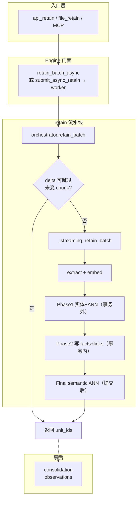

# Retain 导读（重写版）

这不是函数清单，而是：**Retain 在干什么、为什么这么做、代码落在哪、怎么跳着读**。

> 行号会漂移，一律以 **文件路径 + 函数名** 定位。长函数不贴全文，请在 IDE 里跳转对照。  
> 叙事经本地读码 + Claude Code 交叉核对；文中 `#xxxx` 来自源码注释里的 GitHub issue。

## 先读这篇心智模型

**一句话**：Retain 不是「存原文再 embed」，而是把文本变成 **可检索、可链接、可巩固的原子事实网络**，并提前写好 Recall 四路检索所依赖的结构。

复杂度几乎全来自三组张力：

| 张力 | 工程对策 |
|------|----------|
| LLM 慢且贵 ↔ 写入要快、可恢复 | streaming mini-batch、delta、async |
| 检索需要预计算结构 ↔ 结构计算可能失败 | Phase1 读外 / Phase2 短事务 / Phase3 提交后 ANN |
| 并发多租户 ↔ 文档级一致性 | content_hash、`FOR UPDATE`、同 doc 顺序切片 |

带着这三组张力读后面的文档会顺很多。

## 文档怎么排

| 文件 | 读什么 |
|------|--------|
| [01-big-picture.md](./01-big-picture.md) | 产品目标、整体架构图、三层职责 |
| [02-end-to-end.md](./02-end-to-end.md) | 一次请求从 HTTP 走到落库（逐步 + 为什么） |
| [03-design-decisions.md](./03-design-decisions.md) | Streaming / Delta / Async / Phase / Consolidation 等硬设计 |
| [04-code-map.md](./04-code-map.md) | 文件地图、跳转函数、易踩坑 |

## 30 秒总图

## 路径约定

下文路径均相对：

`hindsight-api-slim/hindsight_api/`
